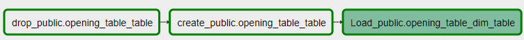
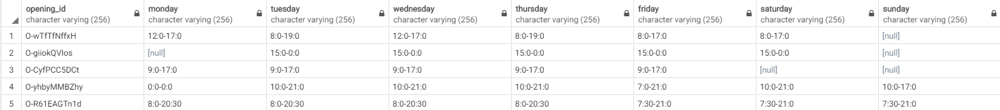
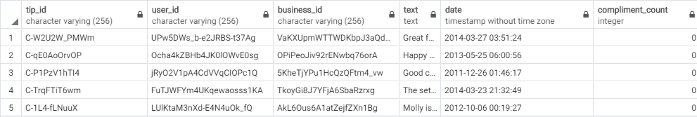

# Data Pipeline for Yelp Reviews

A python program that built data pipelines that are dynamic and built from reusable tasks, can be monitored, and allow easy backfills using Apache Airflow.

## Scope of Project

The project scope is allow the uploading of local files into a local Postgres database on the computer. The steps to achieve this is highlighted below:

1. Perform data quality checks and make the necessary changes to the data files
2. Stage the data within the data files into tables in the Postgres database
3. Load the main tables with data from the staging tables to form te desired data schema in the database
4. Perform data quality checks and make the necessary changes to the tables in the database

The end result of the program is to replicate the desired database schema in the database, with the intention to allow the data owners to be able to easily analyse and study the data in order to garner meaningful insights to improve the performance and user experience of the application.

## Scenarios

__a) The data was increased by 100x__
In this case, it would be advisable for the database to be deployed in an on-premise database server. This will then allow more data to be stored, without the risk of data leak/loss. Another method would be for the company to subscribe to a cloud provider and store their data in a cloud instead, but that would put the data at a higher risk of being leaked.

__b) The pipelines would be run on a daily basis by 7am everyday__
Airflow allows their DAGs to be scheduled. The sample code below demonstrates how the DAG can be scheduled according to the desired timezone:

```python
# Global variables
local_tz = pendulum.timezone("Asia/Bangkok")
start_date = datetime.datetime.now(local_tz)

# DAG parameters
dag = DAG("append_dag",
          default_args=default_args,
          description="Load and transform data",
          schedule_interval= '0 7 * * *'    # Scheduled to run at 7AM daily     ## For other expressions: https://crontab.guru/
)
```

__c) The database needed to be accessed by 100+ people.__
When a database is to be accessed by a large number of people, there are several issues that database administrators have to face:
1. Insufficient memory to uphold connections
2. Decrease in performance of the database when handling large numbers of requests
3. Need for a secure connection to the database

To counter these problems, the use of connection pooling is advised.

Connection pooling is usually used to to handle database connections, where these connections ae pre-allocated and recycled when for new connections. Connection pooling addresses the above issues:

1. Clients can only use a set number of connections. This prevents the database server from crashing.
2. A single connection with pipelined requests which can execute at the same time facilitates query processing and upholds the performance of the database.
3. Since the number of connections is reduced by #1, memory is saved, allowing the server to efficiently establish a secure connection with the connected user, hence improving security.

To understand how connection pooling can be used in the database, click on the link. [https://severalnines.com/database-blog/scaling-connections-postgresql-using-connection-pooling]

## Required libraries

1. airflow [https://airflow.apache.org]

## Installation

### Required software

1. Anaconda [https://www.anaconda.com/]
2. Apache Airflow [https://airflow.apache.org/]
3. cmder [https://cmder.net/]
4. PgAdmin4 [https://www.pgadmin.org/download/pgadmin-4-windows/]
5. PostgreSQL [https://www.postgresql.org]
6. Vagrant [https://www.vagrantup.com/] 

#### A. cmder - Portable console emulator for Windows

1. Download full *cmder* program onto the host machine to allow use of Unix commands. [https://cmder.net/]
2. Open *cmder* console and  continue the rest of the installation

#### B. Oracle Virtual Box

1. Ensure *Hardware Virtualization* has been enabled on the host machine. This can be done through the BIOS.
2. Install the latest Oracle Virtual Box program from the official website [https://www.virtualbox.org]

#### C. Vagrant - ubuntu/bionic64

Since Apache Airflow is only available on Linux, Vagrant can be used to build a virtual machine that runs on Linux. Unlike a regular Virtual machine program like VmWare and Virtual Box, Vagrant lowers development environment setup time and increase production parity. The virtual environment can be interacted through a ssh connection and the use of the environment's command line terminal.

Vagrant allows the environment to be easily and quickly deployed with a single command and can be controlled with a single consistent and disposable environment. The program can also be kept running in the background, allowing Apache Airflow to continue running on schedule without taking much processing power on the host computer. However, this requires some configuration of the virtual environment for it to be possible.

1. Install Vagrant onto host machine
2. Set up Vagrant Box with Ubuntu OS by following the instructions in the link [https://app.vagrantup.com/ubuntu/boxes/bionic64]
3. Make changes to *Vagrantfile* to configure a shared folder between the Vagrant Box and the host machine and to assign private IP address to the Vagrant Box

```text
config.vm.network "private_network", ip: "192.168.33.10"
config.vm.synced_folder "folder/path/on/host", "/vagrant_data/", :owner => "root", :group => "root", :mount_options => ["dmode=777","fmode=666"]
```

4. Ensure that the shared folder has the following structure:

```text
SHARED_FOLDER
|-dags
    - dag.py
    - subdag_check.py
    - subdag_create.py
    - subdag_load.py

|-data
|-plugins
    -__init__.py

    |-helpers
        -__init__.py
        -json_types.py
        -sql_create.py
        -sql_duplicates.py
        -sql_insert.py

    |-operators
        -__init__.py
        -file_data_quality.py
        -load_dimension.py
        -load_fact.py
        -stage_postgres.py
        -table_data_quality.py
```

1. Connect to the Vagrant Box via SSH, *vagrant ssh*
2. Continue the rest of the installation below as a root user, *sudo - i*

#### D. Anaconda Environment

In order to easily deploy the appropriate Python environment for the program, Anaconda was installed. Anaconda allow users to easily manage Python packages to be used by the program and ensures that the program runs in the specified Python version. In this case, it is Python 3.6. Anaconda contains porting for all popular Python libraries used by the program, which saves the user's time on importing multiple libraries separately.

1. Follow instructions in the following link to install Anaconda onto Vagrant Box. Note to replace the link with the latest Anaconda version for Linux. [https://www.digitalocean.com/community/tutorials/how-to-install-anaconda-on-ubuntu-18-04-quickstart]
2. Create Anaconda environment with Python 3.6
3. Activate the created Conda environment before continuing with installation

#### E. Python Program and Packages

1. Using the created environment, install the following packages:

- Refer to the following file to install Apache Airflow [https://coding-stream-of-consciousness.com/2018/11/06/apache-airflow-windows-10-install-ubuntu/]
- 'conda install -c anaconda xlrd'
- 'conda install -c anaconda psycopg2'
- 'pip install cryptography'
- 'pip install python-sql'

2. Change directory to Airflow and make the following changes to *airflow.cfg*:

```text
dags_folder = /vagrant_data/dags
load_examples = False
plugins_folder = /vagrant_data/plugins
```

3. Reset Airflow database with 'airflow resetdb'
4. Run Airflow WebUI with 'airflow webserver'
5. Run Airflow Scheduler with 'airflow scheduler'

#### F. PostgreSQL11 and PgAdmin4 on Ubuntu

PostgreSQL is an open source relational database that does not require users to pay any additional cost to use it. In a Linux environment, it can be easily installed, along with PgAdmin4. PgAdmin4 is a webUI to manage PostgreSQL databases, which is easier compared to the Postgres command, *psql*. With both PostgreSQL and PgAdmin4, users can easily monitor the performance of their data and make queries using the query tool provided in PgAdmin4. Database administrators can also create new users and assign roles to the users, allowing multiple users to access their databases without compromising the confidentiality of other restricted databases belonging to other users.

1. Install PostgreSQL11 by following the instructions in the given link: [https://tecadmin.net/install-postgresql-server-on-ubuntu/]
2. Change the password of the user, *postgres*, by entering the following commands:

```text
sudo su -
psql postgres postgres
\password password
\q
```

3. Install PgAdmin4 by following the instructions in the given link: [https://tecadmin.net/install-pgadmin4-on-ubuntu/]

```text
Default Credentials
---------------------------
username:localhost@postgres
password: password
```

## Files

### DAGs

- dag.py : Main dag file

### Sub DAGs

- subdag_stage.py : Drop, create and load staging tables
- subdag_load.py : Loads all fact and dimensional **tables**
- subdag_check.py : Perform data quality checks on all fact and dimensional tables

### SQL

- json_types.py: Columns and their corresponding data type for data from JSON files
- sql_create.py : SQL statements to drop and create tables
- sql_queries.py : SQL statements to insert data into tables
- sql_duplicates.py: SQL statements to remove duplicates in tables
  
### Operators

- stage_postgres.py : Stage event and log tables from S3 to Redshift
- file_data_quality.py: Run data quality checks on files\
- load_dimensional.py: Insert data into dimensional tables
- load_fact.py : Insert data into fact table
- table_data_quality.py : Run data quality checks on tables

## Running the tests

1. Start Apache Airflow
2. Open Apache Airflow web interface
3. On and trigger the DAG

## Data

### Brief Description

### Files

The files are downloadable from the Kaggle website [https://www.kaggle.com/yelp-dataset/yelp-dataset]

Since all files are in JSON format, some of the files have been converted to CSV format in order to fulfil the requirements for the Udacity Data Engineering Capstone project. The provided Python program, *file_extractor_converter.py*, can be used to convert the files to CSV and to extract the first 5000 lines of the files. Do NOT attempt to run use the original data set on a weak machine.

According to the dataset's description on Kaggle

- 5,200,000 user reviews
- Information on 174,000 businesses
- The data spans 11 metropolitan areas  

The data files available for download are as listed below:

- yelp_academic_dataset_business.json
- yelp_academic_dataset_checkin.json
- yelp_academic_dataset_review.json
- yelp_academic_dataset_tip.json
- yelp_academic_dataset_user.json

### Possible Outcomes

The possible results that can be derived from the dataset is as follows:

- Determine common reasons why customers leave a bad/good review for a restaurant
- Discover what types of cuisines are more prone to customer satisfaction/dissatisfaction
- Rank the restaurants by popularity in each state
- Make restaurant recommendations to users based on the restaurants they had rated positively for

## Pipeline Overview

### New Data Schema

The data schema for the dataset was revised to adopt a mixture of a snowflake and galaxy schema to be used in this project.

#### Snowflake Schema

- Dimension tables in the Snowflake schema are normalized
- Normalization splits up the data into additional tables [business_dim <- (location_dim, opening_dim, checkin_dim), user_table<-(compliment_dim)]

#### Fact Constellation/Galaxy Schema

- Has multiple fact tables [review_table, tip_table]

### Overall Flow of Data


### Flow of data in subdag_stage.py

- stage_checkin


- stage_business

 

- stage_user

 

- stage_review

 

- stage_tip

 

### Flow of data in subdag_load.py
  
#### Dimensional Tables

- load_location

 

- load_opening

 

- load_business

 

- load_compliment

 

- load_user
  


#### Fact Tables

- load_review
  
 

- load_tip

 

### _Flow of data in subdag_check.py_


## Database Overview

### Main Tables Schema

#### location_table

Table contains unique addresses of businesses within the dataset.

| col_name    | data_type         | constraints |
|-------------|-------------------|-------------|
| address     | text              | NOT NULL    |
| city        | varchar(256)      |             |
| state       | varchar(256)      |             |
| postal_code | varchar(256)      |             |
| latitude    | double precision  |             |
| longitude   | double precision  |             |

##### Sample:


#### opening_table

Table contains each unqiue opening hours of businesses within the dataset.

| col_name   | data_type    | constraints |
|------------|--------------|-------------|
| opening_id | varchar(256) | NOT NULL    |
| monday     | varchar(256) | NOT NULL    |
| tuesday    | varchar(256) |             |
| wednesday  | varchar(256) |             |
| thursday   | varchar(256) |             |
| friday     | varchar(256) |             |
| saturday   | varchar(256) |             |
| sunday     | varchar(256) |             |

##### Sample:



#### business_table

Table contains information of each business within the dataset.

| col_name      | data_type       | constraints |
|---------------|-----------------|-------------|
| business_id   | varchar(256)    | NOT NULL    |
| name          | varchar(256)    |             |
| address       | text            |             |
| stars         | real            |             |
| review_count  | int8            |             |
| is_open       | bool            |             |
| attributes    | text            |             |
| categories    | varchar(256)[]  |             |
| opening_id    | varchar(256)    |             |
| checkin_count | int8            |             |

##### Sample:


#### compliment_table

Table contains the unique compliment count of each category for each user.

| col_name      | data_type    | constraints |
|---------------|--------------|-------------|
| compliment_id | varchar(256) | NOT NULL    |
| hot           | int8         |             |
| more          | int8         |             |
| profile       | int8         |             |
| cute          | int8         |             |
| list          | int8         |             |
| note          | int8         |             |
| plain         | int8         |             |
| cool          | int8         |             |
| funny         | int8         |             |
| writer        | int8         |             |
| photos        | int8         |             |

##### Sample:


#### user_table

Table contains information of each unique user in the dataset.

| col_name      | data_type      | constraints |
|---------------|----------------|-------------|
| user_id       | varchar(256)   | NOT NULL    |
| name          | varchar(256)   |             |
| compliment_id | varchar(256)   | NOT NULL    |
| review_count  | int8           |             |
| yelping_since | timestamp      |             |
| useful        | int8           |             |
| funny         | int8           |             |
| cool          | int8           |             |
| elite         | int8[]         |             |
| friends       | varchar(256)[] |             |
| fans          | int8           |             |
| average_stars | real           |             |

##### Sample:


#### review_table

Table contains information of each review in the dataset.

| col_name    | data_type    | constraints |
|-------------|--------------|-------------|
| review_id   | varchar(256) | NOT NULL    |
| user_id     | varchar(256) | NOT NULL    |
| business_id | varchar(256) | NOT NULL    |
| stars       | real         |             |
| useful      | int4         |             |
| funny       | int4         |             |
| cool        | int4         |             |
| text        | text         |             |
| date        | timestamp    |             |

##### Sample:


#### tip_table  

Tabel contains information of each tip in the dataset

| col_name         | data_type    | constraints |
|------------------|--------------|-------------|
| tip_id           | varchar(256) | NOT NULL    |
| user_id          | varchar(256) | NOT NULL    |
| business_id      | varchar(256) | NOT NULL    |
| text             | text         |             |
| date             | timestamp    |             |
| compliment_count | int4         |             |

##### Sample:



## Project Overview

### Built with

[Anaconda](https://www.anaconda.com/) - Virtual environment \
[Apache Airflow](https://airflow.apache.org) - Data processing pipeline \
[cmder](https://cmder.net/) - Console emulator for Windows\
[PgAdmin4](https:/www.pgadmin.org) - WebUI for PostgreSQL \
[PostgreSQL](https://www.postgresql.org) - Database \
[Python](https://www.python.org/) - Programming language

### Information

[Data Schemas](https://www.tutorialspoint.com/dwh/dwh_schemas.htm) - Data schemas in data warehousing
[Database Diagram](https://dbdiagram.io) - Database diagram visualizer
[Postgres](https://severalnines.com/database-blog/scaling-connections-postgresql-using-connection-pooling) - Information on connection pooling

### Authors

**Jobelle Lee** - [themaxermister](https://github.com/themaxermister/DEND-Final_Capstone)
